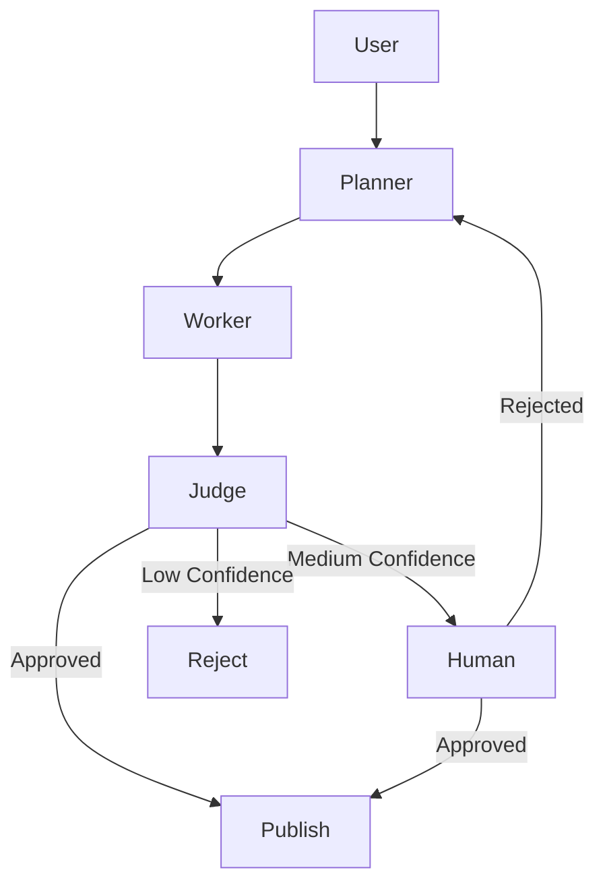
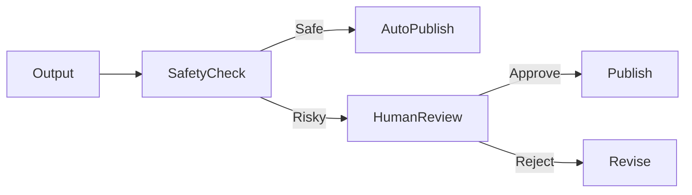
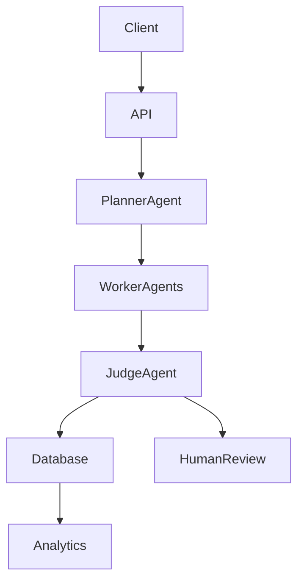

# Domain Architecture Strategy — Project Chimera

**Task 1.2 — Planning Before Coding**
**Goal:** Define agent architecture, human oversight, and data storage strategy before implementation.

---

## 1. Purpose of This Document

This document outlines the **agent pattern, governance strategy, human-in-the-loop checkpoints, and database choice** for Project Chimera. The goal is to design a system that is **scalable, safe, testable, and aligned with multi-agent best practices**.

---

## 2. Agent Pattern Selection

### Candidate Patterns Considered

| Pattern                    | Description                                       | Pros                      | Cons                    |
| -------------------------- | ------------------------------------------------- | ------------------------- | ----------------------- |
| Sequential Chain           | Single agent executes steps in order              | Simple                    | High hallucination risk |
| Swarm / Collective         | Many agents act in parallel                       | Creative, fast            | Hard to control         |
| Hierarchical Swarm         | Manager assigns tasks to workers                  | Scalable                  | Coordination complexity |
| Planner–Worker–Judge (PWJ) | Separation of planning, execution, and validation | Safe, reliable, auditable | Slightly slower         |

---

### Selected Pattern: **Planner–Worker–Judge

#### Rationale

This pattern best fits Project Chimera because:

* It **reduces hallucinations** by separating responsibilities
* It supports **governance and safety enforcement**
* It enables **modular, reusable skills**
* It aligns with real-world **enterprise AI architectures**

#### Role Breakdown

| Agent Role      | Responsibility                                      |
| --------------- | --------------------------------------------------- |
| Planner Agent   | Decides task scope and workflow                     |
| Worker Agent(s) | Executes skills (generate content, analyze data)    |
| Judge Agent     | Reviews output for safety, accuracy, and compliance |
| Human Reviewer  | Approves sensitive or low-confidence content        |

---

## 3. Agent Workflow Architecture (Mermaid Diagram)

---

## 4. Human-in-the-Loop (Safety Layer)

### Where Human Approval Occurs

Human review is required when:

* Confidence score < **0.90** and > **0.70**
* Content involves **politics, health, finance, or legal topics**
* Content is flagged for **bias, misinformation, or ethical risk**
* The agent requests clarification

### Safety Flow

---

## 5. Database Strategy — SQL vs NoSQL for High-Velocity Video Metadata

### Problem Context

The system stores **high-volume video metadata**, such as:

* Video IDs
* Timestamps
* Engagement metrics
* Content tags
* Processing logs

---

### Option A — SQL (Relational Database)

**Pros:**

* Strong consistency
* Structured schema
* Complex query support

**Cons:**

* Less flexible for evolving metadata
* Harder to scale horizontally

---

### Option B — NoSQL (Document / Key-Value)

**Pros:**

* Handles **high write throughput**
* Flexible schema for evolving metadata
* Scales horizontally (ideal for video events)

**Cons:**

* Weaker relational constraints

---

### Selected Choice: **NoSQL (MongoDB)**

#### Justification

NoSQL is better suited because:

* Video metadata is **high-velocity and event-driven**
* Schema may **evolve frequently**
* System requires **fast ingestion and retrieval**
* Horizontal scaling is essential for growth

---

## 6. High-Level Infrastructure Architecture

---

## 7. Governance & Control Principles

The architecture enforces:

* **Human-in-the-loop for sensitive actions**
* **Confidence-based approval thresholds**
* **Tool access via controlled MCP layer**
* **Rate limiting & cost controls**
* **Audit logs for traceability**

---

## 8. Summary of Architectural Strategy

| Decision Area | Selected Strategy                  |
| ------------- | ---------------------------------- |
| Agent Pattern | Planner–Worker–Judge Hybrid        |
| Safety Model  | Human-in-the-Loop                  |
| Database      | NoSQL for scalability              |
| Communication | Structured agent messaging         |
| Governance    | Confidence thresholds & audit logs |

---

## 9. Conclusion

This strategy prioritizes **safety, modularity, scalability, and governance**. It ensures Project Chimera can operate in **multi-agent ecosystems**, integrate **human oversight**, and manage **high-volume media metadata** without sacrificing control or reliability.

---

