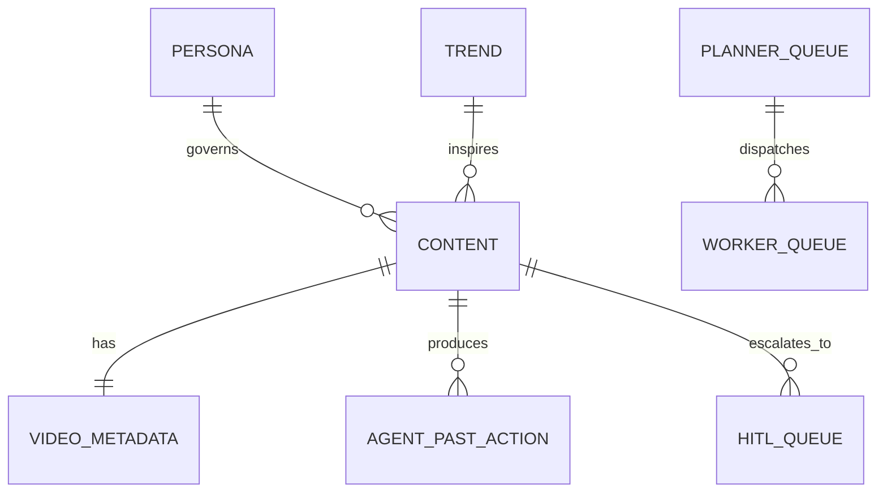

# specs/technical.md — Project Chimera Technical Specification

## Purpose

This document defines the **technical interfaces, MongoDB schemas, agent communication contracts, and MCP tool specifications** for **Project Chimera**, an **Autonomous Influencer Network**.

It serves as the **single source of truth** before implementation. All production code must conform to this specification.

---

## 1. System Architecture Overview

Project Chimera is a **Planner → Worker → Judge** multi-agent system that:

1. Detects trends
2. Plans content strategy
3. Generates media
4. Reviews safety & quality
5. Publishes to social platforms
6. Learns from engagement feedback

### Core Components

* **Planner Agent** — selects goals & tasks
* **Worker Agents** — generate content & media
* **Judge Agent** — evaluates risk & quality
* **Publisher Service** — posts content to platforms
* **MongoDB** — stores metadata & agent memory
* **Skills Layer** — runtime tool execution
* **Human-in-the-Loop (HITL)** — safety escalation

---

## 2. MongoDB Schema Definitions (`#define mongoschema`)

### 2.1 Persona Schema

Stores immutable agent identity & tone.

```ts
Persona {
  _id: ObjectId,
  name: string,
  tone: "professional" | "lighthearted",
  directives: [string],
  voiceStyle: string,
  createdAt: Date
}
```

---

### 2.2 Content Schema

Stores influencer-generated content.

```ts
Content {
  _id: ObjectId,
  topic: string,
  platform: "twitter" | "instagram" | "threads" | "tiktok",
  caption: string,
  script: string,
  mediaUrls: [string],
  status: "draft" | "approved" | "published",
  createdAt: Date
}
```

---

### 2.3 Video Metadata Schema (High‑Velocity Media)

```ts
VideoMetadata {
  contentId: ObjectId,
  durationSeconds: number,
  resolution: string,
  codec: string,
  fileSizeMB: number,
  processingStatus: "queued" | "rendered",
  createdAt: Date
}
```

---

### 2.4 Trend Schema

```ts
Trend {
  topic: string,
  source: string,
  score: number,
  fetchedAt: Date
}
```

---

### 2.5 Agent Past Action Schema

Stores agent decisions & reasoning history.

```ts
AgentPastAction {
  agent: string,
  action: string,
  reasoning: string,
  confidence: number,
  timestamp: Date
}
```

---

### 2.6 Planner Queue Schema

```ts
PlannerQueue {
  taskId: string,
  goal: string,
  priority: "high" | "medium" | "low",
  status: "pending" | "assigned"
}
```

---

### 2.7 Worker Queue Schema

```ts
WorkerQueue {
  taskId: string,
  workerId: string,
  progress: number,
  outputRef: string
}
```

---

### 2.8 Human‑in‑the‑Loop Queue Schema (HITL)

```ts
HITLQueue {
  contentId: ObjectId,
  riskReason: string,
  escalationLevel: "medium" | "high",
  resolved: boolean
}
```

---

## 3. Database ERD (Mermaid)



---

## 4. API Contracts (`#api contracts`)

### 4.1 Fetch Trends

```http
GET /api/trends
```

Response:

```json
{
  "trends": [
    { "topic": "AI Agents", "score": 0.92 }
  ]
}
```

---

### 4.2 Planner → Create Task

```http
POST /api/planner/create-task
```

```json
{
  "trend": "AI Agents",
  "platform": "twitter",
  "persona": "professional"
}
```

---

### 4.3 Worker → Submit Output

```http
POST /api/worker/submit
```

```json
{
  "taskId": "uuid",
  "caption": "AI is changing software",
  "mediaUrls": []
}
```

---

### 4.4 Judge → Review Output

```http
POST /api/judge/review
```

```json
{
  "contentId": "abc123"
}
```

Response:

```json
{
  "approved": true,
  "riskScore": 0.03
}
```

---

### 4.5 Publisher → Publish Content

```http
POST /api/publish
```

```json
{
  "contentId": "abc123",
  "platform": "twitter"
}
```

---

## 5. Agent Communication Protocols (`#agent communication protocols`)

### 5.1 Planner → Worker Interface

```json
{
  "task_id": "uuid-v4-string",
  "task_type": "generate_content | reply_comment",
  "priority": "high | medium | low",
  "context": {
    "goal_description": "string",
    "persona_constraints": ["string"],
    "required_resources": ["mcp://twitter/mentions/recent"]
  },
  "assigned_worker_id": "string",
  "created_at": "timestamp",
  "status": "pending | in_progress | review | complete"
}
```

---

### 5.2 Worker → Judge Interface

```json
{
  "contentId": "abc123",
  "confidence_score": 0.91,
  "notes": "Caption generated with professional tone"
}
```

---

### 5.3 Judge → Planner Interface

```json
{
  "taskId": "uuid",
  "approved": true,
  "feedback": "Safe and aligned"
}
```

---

## 6. MCP Tooling (`#mcp`)

### Declared MCP Servers

* `post_content_mcp`
* `read_content_mcp`
* `save_to_storage_mcp`
* `read_from_storage_mcp`
* `filesystem_mcp`
* `git_mcp`

---

### MCP Example — `post_content_mcp`

```json
{
  "name": "post_content",
  "description": "Publishes text and media to a connected social platform.",
  "inputSchema": {
    "type": "object",
    "properties": {
      "platform": {
        "type": "string",
        "enum": ["twitter", "instagram", "threads"]
      },
      "text_content": {
        "type": "string",
        "description": "The body of the post/tweet."
      },
      "media_urls": {
        "type": "array",
        "items": { "type": "string" }
      },
      "disclosure_level": {
        "type": "string",
        "enum": ["automated", "assisted", "none"]
      }
    },
    "required": ["platform", "text_content"]
  }
}
```

---

## 7. Skills vs MCP Clarification

**MCP = Developer tools** (used in IDE & ops)
**Skills = Runtime agent capabilities**

### Runtime Skills

* `skill_fetch_trends`
* `skill_generate_caption`
* `skill_generate_media`
* `skill_publish_social`
* `skill_store_memory`

Each Skill follows **strict Input → Output contracts**.

---

## 8. Security & Safety Enforcement

* Judge Agent rejects unsafe or misleading content
* Confidence < **0.9** and > **0.7** → HITL Queue
* Confidence < **0.7** and > Reject
* Political, legal, or medical content → Human Review
* All agent decisions logged in `AgentPastAction`

---

## 9. Observability & Logging

Agents log:

* Decisions
* Errors
* Confidence scores
* Publishing results

Used for:

* Debugging
* Governance auditing
* Continuous alignment improvement

---

## 10. Implementation Rule

> **No production code may be written unless it conforms to this `technical.md` specification.**

This document is the **single source of truth** for Chimera’s backend, database, agents, and developer tooling.

# specs/technical.md — Project Chimera Technical Specification

## Purpose

This document defines the **technical interfaces, MongoDB schemas, agent communication contracts, and MCP tool specifications** for **Project Chimera**, an **Autonomous Influencer Network**.

It serves as the **single source of truth** before implementation. All production code must conform to this specification.

---

## 1. System Architecture Overview

Project Chimera is a **Planner → Worker → Judge** multi-agent system that:

1. Detects trends
2. Plans content strategy
3. Generates media
4. Reviews safety & quality
5. Publishes to social platforms
6. Learns from engagement feedback

### Core Components

* **Planner Agent** — selects goals & tasks
* **Worker Agents** — generate content & media
* **Judge Agent** — evaluates risk & quality
* **Publisher Service** — posts content to platforms
* **MongoDB** — stores metadata & agent memory
* **Skills Layer** — runtime tool execution
* **Human-in-the-Loop (HITL)** — safety escalation

---

## 2. MongoDB Schema Definitions (`#define mongoschema`)

### 2.1 Persona Schema

Stores immutable agent identity & tone.

```ts
Persona {
  _id: ObjectId,
  name: string,
  tone: "professional" | "lighthearted",
  directives: [string],
  voiceStyle: string,
  createdAt: Date
}
```

---

### 2.2 Content Schema

Stores influencer-generated content.

```ts
Content {
  _id: ObjectId,
  topic: string,
  platform: "twitter" | "instagram" | "threads" | "tiktok",
  caption: string,
  script: string,
  mediaUrls: [string],
  status: "draft" | "approved" | "published",
  createdAt: Date
}
```

---

### 2.3 Video Metadata Schema (High‑Velocity Media)

```ts
VideoMetadata {
  contentId: ObjectId,
  durationSeconds: number,
  resolution: string,
  codec: string,
  fileSizeMB: number,
  processingStatus: "queued" | "rendered",
  createdAt: Date
}
```

---

### 2.4 Trend Schema

```ts
Trend {
  topic: string,
  source: string,
  score: number,
  fetchedAt: Date
}
```

---

### 2.5 Agent Past Action Schema

Stores agent decisions & reasoning history.

```ts
AgentPastAction {
  agent: string,
  action: string,
  reasoning: string,
  confidence: number,
  timestamp: Date
}
```

---

### 2.6 Planner Queue Schema

```ts
PlannerQueue {
  taskId: string,
  goal: string,
  priority: "high" | "medium" | "low",
  status: "pending" | "assigned"
}
```

---

### 2.7 Worker Queue Schema

```ts
WorkerQueue {
  taskId: string,
  workerId: string,
  progress: number,
  outputRef: string
}
```

---

### 2.8 Human‑in‑the‑Loop Queue Schema (HITL)

```ts
HITLQueue {
  contentId: ObjectId,
  riskReason: string,
  escalationLevel: "medium" | "high",
  resolved: boolean
}
```

---

## 3. Database ERD (Mermaid)


---

## 4. API Contracts (`#api contracts`)

### 4.1 Fetch Trends

```http
GET /api/trends
```

Response:

```json
{
  "trends": [
    { "topic": "AI Agents", "score": 0.92 }
  ]
}
```

---

### 4.2 Planner → Create Task

```http
POST /api/planner/create-task
```

```json
{
  "trend": "AI Agents",
  "platform": "twitter",
  "persona": "professional"
}
```

---

### 4.3 Worker → Submit Output

```http
POST /api/worker/submit
```

```json
{
  "taskId": "uuid",
  "caption": "AI is changing software",
  "mediaUrls": []
}
```

---

### 4.4 Judge → Review Output

```http
POST /api/judge/review
```

```json
{
  "contentId": "abc123"
}
```

Response:

```json
{
  "approved": true,
  "riskScore": 0.03
}
```

---

### 4.5 Publisher → Publish Content

```http
POST /api/publish
```

```json
{
  "contentId": "abc123",
  "platform": "twitter"
}
```

---

## 5. Agent Communication Protocols (`#agent communication protocols`)

### 5.1 Planner → Worker Interface

```json
{
  "task_id": "uuid-v4-string",
  "task_type": "generate_content | reply_comment",
  "priority": "high | medium | low",
  "context": {
    "goal_description": "string",
    "persona_constraints": ["string"],
    "required_resources": ["mcp://twitter/mentions/recent"]
  },
  "assigned_worker_id": "string",
  "created_at": "timestamp",
  "status": "pending | in_progress | review | complete"
}
```

---

### 5.2 Worker → Judge Interface

```json
{
  "contentId": "abc123",
  "confidence_score": 0.91,
  "notes": "Caption generated with professional tone"
}
```

---

### 5.3 Judge → Planner Interface

```json
{
  "taskId": "uuid",
  "approved": true,
  "feedback": "Safe and aligned"
}
```

---

## 6. MCP Tooling (`#mcp`)

### Declared MCP Servers

* `post_content_mcp`
* `read_content_mcp`
* `save_to_storage_mcp`
* `read_from_storage_mcp`
* `filesystem_mcp`
* `git_mcp`

---

### MCP Example — `post_content_mcp`

```json
{
  "name": "post_content",
  "description": "Publishes text and media to a connected social platform.",
  "inputSchema": {
    "type": "object",
    "properties": {
      "platform": {
        "type": "string",
        "enum": ["twitter", "instagram", "threads"]
      },
      "text_content": {
        "type": "string",
        "description": "The body of the post/tweet."
      },
      "media_urls": {
        "type": "array",
        "items": { "type": "string" }
      },
      "disclosure_level": {
        "type": "string",
        "enum": ["automated", "assisted", "none"]
      }
    },
    "required": ["platform", "text_content"]
  }
}
```

---

## 7. Skills vs MCP Clarification

**MCP = Developer tools** (used in IDE & ops)
**Skills = Runtime agent capabilities**

### Runtime Skills

* `skill_fetch_trends`
* `skill_generate_caption`
* `skill_generate_media`
* `skill_publish_social`
* `skill_store_memory`

Each Skill follows **strict Input → Output contracts**.

---

## 8. Security & Safety Enforcement

* Judge Agent rejects unsafe or misleading content
* Confidence < **0.75** → HITL Queue
* Political, legal, or medical content → Human Review
* All agent decisions logged in `AgentPastAction`

---

## 9. Observability & Logging

Agents log:

* Decisions
* Errors
* Confidence scores
* Publishing results

Used for:

* Debugging
* Governance auditing
* Continuous alignment improvement

---

## 10. Implementation Rule

> **No production code may be written unless it conforms to this `technical.md` specification.**

This document is the **single source of truth** for Chimera’s backend, database, agents, and developer tooling.
